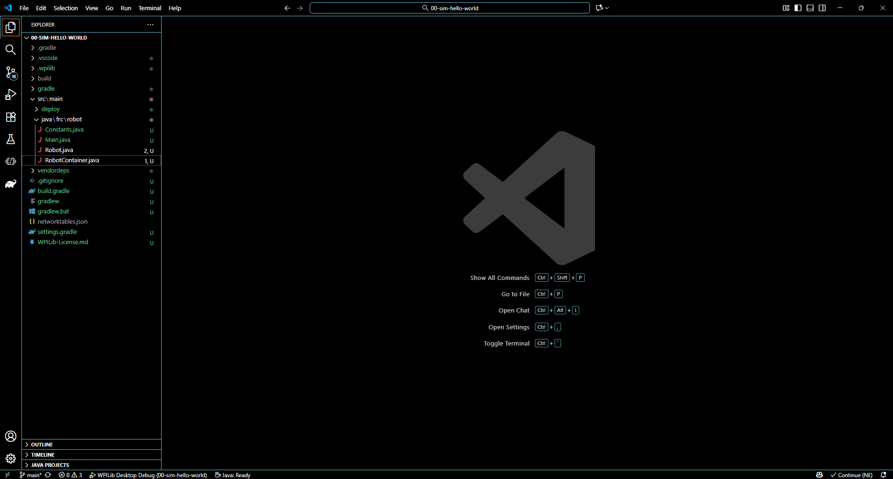
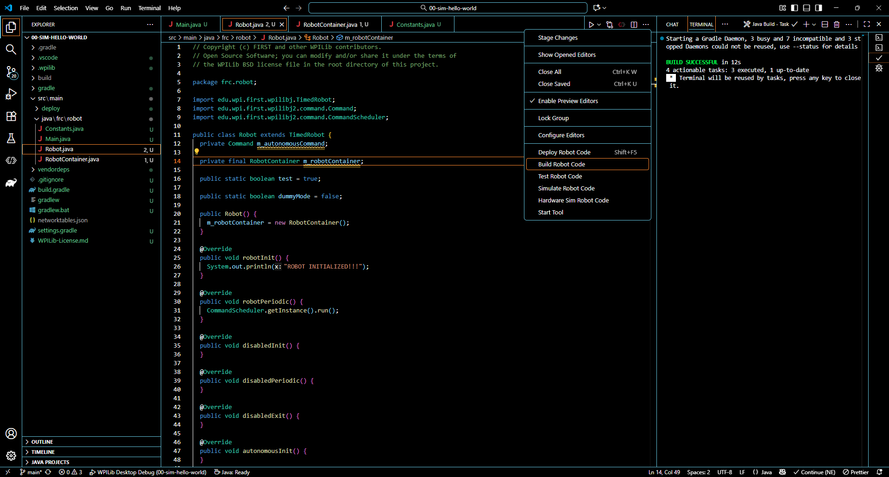
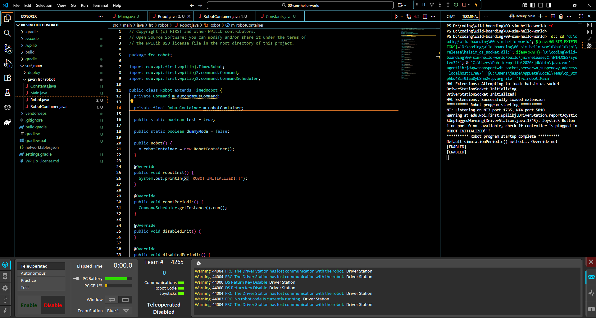

## Contents
 - [Initial Setup](#initial-setup) 
 - [Simulation Hello World](#00-sim-hello-world) 

## Initial Setup

[Back to Contents](#contents)

Below are the minimal steps to get up and running with running Java on our FRC Robots and testbeds using our example code.

### Install FRC Game Tools

To be able to control and test with the RoboRIO, we will need to have the following software installed:
  - FRC Game Tools
    - LabVIEW Update
    - FRC Driver Station
    - FRC RoboRIO Imaging Tool and Images

For detailed documentation on how to install, FIRST has great documentation [here](https://docs.wpilib.org/en/stable/docs/zero-to-robot/step-2/frc-game-tools.html).

### Installing VSCode with WPILib Command Palette

To develop Java code for our robots, we are utilizing a special version of VSCode that has been customized to make FRC Robot development easier.

For detailed documentation on how to install, FIRST has great documentation [here](https://docs.wpilib.org/en/stable/docs/zero-to-robot/step-2/wpilib-setup.html).
  - NOTE: FIRST may not have updated their docs to point to the latest version of VSCode with WPILib, to check for the latest version, you can view it on their Github release page [here](https://github.com/wpilibsuite/vscode-wpilib/releases).

### Preparing Your Robot

If you are using hardware (RoboRIO and Radio) that has already been configured, such as Linguini or another robot, you can skip this section. Otherwise, if your RoboRIO and Radio are new, you will need to image and program them respectively.

For detailed documentation on how to this, FIRST has great documentation, below are the links to the documentation for each:
  - [Imaging RoboRIO](https://docs.wpilib.org/en/stable/docs/zero-to-robot/step-3/roborio2-imaging.html)
  - [Programming Radio](https://docs.wpilib.org/en/stable/docs/zero-to-robot/step-3/radio-programming.html)

At this point you should have all the software tools and necessary hardware equipment setup to be able to start working through these examples.

### Clone this repository

To use and work with our examples, you will need to clone this repository from Github. We use [GIT](https://www.git-scm.com) as a version control and the below commands will be for GIT.
  - NOTE: Windows users may want to install either of the software below:
    - 4265 Team uses [TortoiseGit](https://tortoisegit.org)
    - Another alternative is [Git For Windows](https://gitforwindows.org)

1. Open up a terminal session and navigate to a directory you want to clone the repository.
1. Use the following command in the terminal to clone this repository:
   ```bash
   git clone https://github.com/secret-city-wildbots/wild-boarding.git
   ```

## 00-sim-hello-world

[Back to Contents](#contents)

### Description

The goal of this section is to do the following:

1. Be able to run code in simulation
1. Be able to use the Driverstation
1. Understand & Modify the simple template code given

### Setup VSCode

To be able to use VSCode with this example, you will need to make sure you open VSCode to the specific folder, below are the steps:

  1. launch the WPILIB VSCode application
  1. While your new window is in focus, Go to `File` -> `Open Folder...`
  1. Select the directory `00-sim-hello-world`
  1. Now you should be able to code and utilize all of the features built into the WPILib version of VSCode. Your VSCode should look like something below:
     

### Code Overview

The main code lives in the `src/main/java/frc/robot` directory. There are 4 files:
  - Main.java
     - entry point for the program
  - Robot.java
    - This contains all of the init and periodic functions for the robot
       - robot
       - autonomous
       - teleop
       - disabled
       - test
       - simulation
  - RobotContainer.java
    - This is a class that contains all of the robot's subsystems and their corresponding classes
    - Also contains the controller instance and all of it's bindings


you will notice on lines 24 - 27 in `Robot.java` the following code:

```java
@Override
  public void robotInit() {
    System.out.println("ROBOT INITIALIZED!!!");
  }
```

and 58-61:

```java
 @Override
  public void teleopInit() {
    System.out.println("[ENABLED]");
  }
```

The `init` function(s), will typically be called once that mode starts, such as `teleopInit` being run whenever the robot is put into teleop mode (enabled), or `robotInit` being called when the robot code starts.

### Running Example

1. In VSCode, you will hit the `...` on the top right and click `Build Robot Code`. You should see `BUILD SUCCESSFUL` in the terminal of VSCode
   
1. Now open up the FRC Driver Station and plug in an Xbox controller
1. In VSCode, you will hit the `...` on the top right again and click `Simulate Robot Code`
1. The will be a prompt at the top of the window. Ensure `Use Real DriverStation` is selected, then click `ok`
1. On the DriverStation, make sure `TeleOperated` is selected and then click the `Enable` button
   
1. Once Enabled, press the `A` button on the controller, and it should log `A WAS PRESSED` in the terminal of VSCode. IT WILL NOT LOG IN THE DRIVERSTATION.